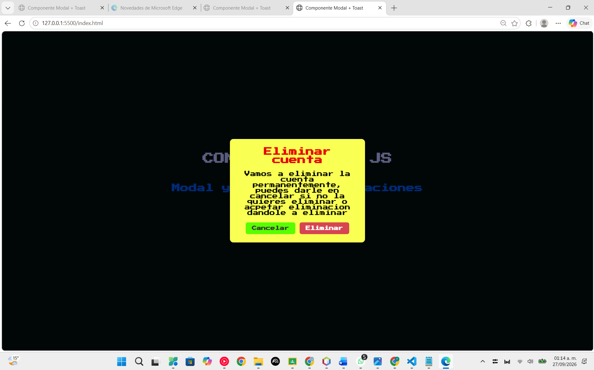
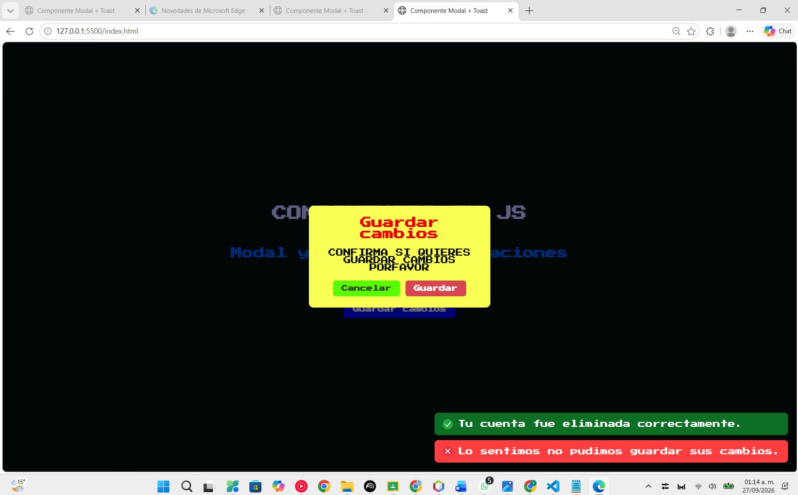

# Componente Modal + Toast Notificación

**Alumno:** Ruiz Chavez Youri Jorkaeff

## ¿Qué hice y qué problema resuelve?

Para esta actividad hice un componente visual reutilizable en JavaScript puro, combinando dos piezas que se conectan entre sí: un Modal (una ventana emergente de confirmación) y un sistema de Toast Notifications (notificaciones pequeñas que aparecen flotando en una esquina de la pantalla y se ocultan solas).

La idea es resolver un problema común en cualquier página: cuando el usuario va a hacer algo importante (como eliminar algo o guardar cambios), primero se le debe pedir confirmación con una ventana clara, y después se le debe avisar si la acción se realizó con éxito, sin necesidad de una alerta genérica del navegador que se ve poco profesional. El Modal se encarga de la confirmación, y el Toast se encarga del aviso final — y los dos trabajan juntos: cuando confirmas algo en el Modal, automáticamente se dispara un Toast de éxito.

A diferencia de la librería de la actividad anterior (que solo validaba datos por detrás, sin mostrar nada en pantalla), aquí el componente sí tiene una parte visual real: una ventana con botones, y una notificación con ícono y color según el tipo de mensaje.

## Cómo lo construí

No escribí el HTML del modal ni del toast directamente en el archivo `index.html`. En vez de eso, hice que JavaScript los **construya desde cero cada vez que se necesitan**, usando `document.createElement` para ir armando cada pieza (el fondo oscuro, la caja blanca, el título, los botones, etc.) y `appendChild` para irlas metiendo una dentro de otra. Esto es justo lo que hace que el componente sea reutilizable: como todo el contenido llega por parámetros, puedo llamar a la misma función con un título, un mensaje y un botón distintos cada vez, sin tener que copiar y pegar un bloque de HTML nuevo por cada caso de uso.

- **`crearModal(titulo, mensaje, textoBotonConfirmar, funcionAlConfirmar)`**: arma el modal completo por código. Lo interesante es el último parámetro: es una función que yo mismo defino cada vez que llamo a `crearModal`, y que solo se ejecuta si el usuario le da clic al botón de confirmar. Ahí es donde conecto el modal con el toast: dentro de esa función es donde mando llamar a `mostrarToast()`.

- **`mostrarToast(mensaje, tipo, duracionEnMilisegundos)`**: crea la notificación flotante. Según el texto que reciba en `tipo` ("exito", "error" o cualquier otro valor, que tomo como advertencia), le pone un color y un ícono distintos. Después de la cantidad de milisegundos que le indique, se elimina sola usando `setTimeout`, sin que el usuario tenga que cerrarla.

En mi página de demostración (`index.html`) puse dos botones distintos ("Eliminar cuenta" y "Guardar cambios") que llaman al mismo `crearModal()`, pero cada uno con su propio título, mensaje y toast de resultado — así se nota que no es algo fijo, sino un componente genérico que se adapta al contenido que le mande.

## Instalación

Para usar este componente en un proyecto, estos son los pasos que seguí:

1. **Copié los archivos `componente.css` y `componente.js`** dentro de las carpetas `css` y `js` del proyecto, respectivamente.

2. **En el `<head>` del HTML**, agregué el enlace a la hoja de estilos, para que los estilos del modal y del toast estén disponibles desde que carga la página:

```html
   <link rel="stylesheet" href="css/componente.css">
```

3. **Antes de cerrar `</body>`**, agregué la etiqueta que carga el JavaScript del componente:

```html
   <script src="js/componente.js"></script>
```

4. **Si mi página tiene otro `<script>` con la lógica propia** (por ejemplo, qué botón abre qué modal), ese script debe ir **después** del que carga `componente.js`, nunca antes, porque ahí es donde se definen las funciones `crearModal` y `mostrarToast` que voy a usar:

```html
   <script src="js/componente.js"></script>
   <script>
     // aqui ya puedo usar crearModal(...) y mostrarToast(...)
   </script>
```

5. **Si el componente usa íconos** (como en mi caso, para los toasts de éxito, error y advertencia), también copié la carpeta `img` con esas imágenes al proyecto, respetando las rutas que uso dentro de `componente.js` (`img/icono-exito.png`, etc.).

A partir de ahí, las funciones `crearModal()` y `mostrarToast()` quedan disponibles para llamarse desde cualquier botón o evento de mi página.

## Uso

### Abrir un modal de confirmación

```javascript
crearModal(
  "Eliminar cuenta",
  "Vamos a eliminar la cuenta permanentemente, puedes darle en cancelar si no la quieres eliminar o acpetar eliminacion dandole a eliminar",
  "Eliminar",
  function () {
    // esto se ejecuta solo si el usuario confirma
    mostrarToast("Tu cuenta fue eliminada correctamente.", "exito", 4000);
  }
);
```

### Mostrar un toast por separado

```javascript
mostrarToast("Ocurrio un error al guardar los datos.", "error", 4000);
```

### Reutilizando el mismo modal con contenido distinto

```javascript
crearModal(
  "Guardar cambios",
  "CONFIRMA SI QUIERES GUARDAR CAMBIOS PORFAVOR",
  "Guardar",
  function () {
    mostrarToast("Lo sentimos no pudimos guardar sus cambios.", "error", 4000);
  }
);
```

## Capturas de pantalla





## Demo en vivo

<https://youri22-eng.github.io/Actividad-3-Componente.js/>

## Video

Video demo de máximo 1 minuto mostrando el problema que resuelve el componente, cómo se usa, y el resultado en acción:

[Ver video demo](<https://youtu.be/71owEDJrJlY>)